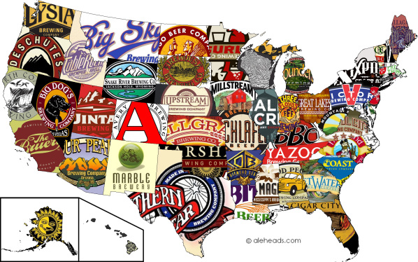

<h2 style="text-align: center;" markdown="1">Exploring the consumption, taxation, and production of beer in the United States.  </h2>
<h6 style="text-align: center;" markdown="1">By: Amy Pitts (ajp2257)| Ruiyang Li (rl3034)| Wenbo Fei (wf2270)| Ziyi Wang (zw2716)</h6>


<center>

{width=500px}

*Image from [The Best Beer By State](https://aleheads.wordpress.com/2012/07/09/the-best-beer-by-state/ )
</center>

---

## Introduction:
The US Government continues to control the consumption and production of Beer through regulations and taxes. The Alcohol and Tobacco Tax and Trade Bureau regulates people who engage in the alcohol beverage industry by requiring people to file an application before engaging in business [(TTB.gov)](https://www.ttb.gov/alcohol/beverage-alcohol). Through this reporting and taxation, the US profits enormously off of Beer. Since beer plays such an important role in the US economy it is important to analyze the publicly available government data all about taxation and production and consumption. This project compiled data from 3 different sources to try to understand how beer taxation, consumption, and production differ between each state. In the search to understand how states differ, we created statistical models looking to see if how states regulate beer taxation, production, and consumption differ with varying jurisdiction types [(control or licensed)](https://www.ncsla.org/State-Officials.html). 

---

## Screencast*

---

## Datasets

* Yearly Statistical Beer Data by State (2008 – 2019) from [Alcohol and Tobacco Tax and Trade Bureau](https://www.ttb.gov/beer/statistics). This aggregated data contained records on Tax Determined, Taxable Volume of Bottles and Cans, Taxable Volume of Barrels and Kegs each year for each state in barrels.

* Open Beer database from [Opendatasoft](https://data.opendatasoft.com/explore/dataset/open-beer-database%40public-us/information/?rows=4588&timezone=&refine.country=United+States&location=2,16.98232,9.498&basemap=jawg.sunny&dataChart=eyJxdWVyaWVzIjpbeyJjb25maWciOnsiZGF0YXNldCI6Im9wZW4tYmVlci1kYXRhYmFzZUBwdWJsaWMtdXMiLCJvcHRpb25zIjp7fX0sImNoYXJ0cyI6W3siYWxpZ25Nb250aCI6dHJ1ZSwidHlwZSI6ImxpbmUiLCJmdW5jIjoiQVZHIiwieUF4aXMiOiJhYnYiLCJzY2llbnRpZmljRGlzcGxheSI6dHJ1ZSwiY29sb3IiOiIjMTQyRTdCIn1dLCJ4QXhpcyI6Imxhc3RfbW9kIiwibWF4cG9pbnRzIjoiIiwidGltZXNjYWxlIjoieWVhciIsInNvcnQiOiIifV0sImRpc3BsYXlMZWdlbmQiOnRydWUsImFsaWduTW9udGgiOnRydWV9). This dataset contains information of each beer product, including product name, universal product code, style, category, brewer along with its address and website, percentage of alcohol by volume, bitterness from hops in a beer, beer color, and description in text.

* This data is gotten from the [American Beer Distributors](https://www.nbwa.org/resources/state-data). This website aims to collect data on beer consumption, taxation and shipment. They have produced a number of there own reports but they have the data they used avaiable in pdf form. The pdf document are [Summary of Effective State Excise Tax Rates by State](https://www.nbwa.org/sites/default/files/Beer%20Excise%20Tax%202019%20-%20Revised%20July%202020.pdf)
and [Shipments of Malt Beverages and Per Capita Consumption by State](https://www.nbwa.org/sites/default/files/2003%20and%202019%20State%20data%20Per%20Capita%20Sheets_1.pdf). Due to the difficult of working with pdf documents in R and pdf to excel online file converter was used to access this data. These files include data on taxation rate per barrel, shipment of beer, consumption of beer per capita, and population over the age of 21. 

---

## Findings

```{r setup, include = F}
library(tidyverse)
library(plotly)
library(flexdashboard)
library(leaflet)
library(sf)
library(mapview)
knitr::opts_chunk$set(
  fig.width = 6,
  fig.asp = .6,
  out.width = "90%"
)
theme_set(theme_minimal() + theme(legend.position = "bottom"))
options(
  ggplot2.continuous.colour = "viridis",
  ggplot2.continuous.fill = "viridis"
)
scale_colour_discrete = scale_colour_viridis_d
scale_fill_discrete = scale_fill_viridis_d
```

```{r read_df, collapse = T, message = F, warning = F, include = F}
tax_df = read_csv("./data_import_cleaning/tax.csv")
beer = read_csv("./data_import_cleaning/beer.csv")
```

---

### Beer Tax in U.S. State
```{r tax map, collapse = T, message = F, warning = F}
state_df = # arrange row order
  tibble(
    state = state.abb, # arrange row order according default state.abb
    state.name = state.name
  )

tax <- 
  left_join(state_df, tax_df, by = "state")

g <- list(
  scope = 'usa',
  projection = list(type = 'albers usa'),
  lakecolor = toRGB('white')
)

tax_2019 <- tax %>% pull(14)         
plot_geo() %>%
  add_trace(
    z = ~tax_2019, span = I(0),
    locations = state.abb, locationmode = 'USA-states',
    hoverinfo = 'text',
    text = ~paste('</br>', state.name,
                      '</br> Year: ', 2019,
                      '</br> Tax: ', tax_2019)
  ) %>%
  layout(geo = g,
         title = "Taxation Choropleth of 2019 (In Barrels)") %>%
  config( fillFrame = TRUE)
```

---

### U.S. brewers Location mapping
 Map location of each US brewer with category/style, size of marker showing ABV (Alcohol by volume) and interactive label showing the tax info by state.
```{r brewer map, collapse = T, message = F, warning = F}
#install.packages("leaflet")
library(leaflet)
pal <- colorNumeric(
  palette = "viridis",
  domain = beer$alcohol_by_volume)
beer %>% 
  filter(alcohol_by_volume != 0) %>% 
  mutate(
    click_label = 
      str_c("<b>Brewer: ", name,
            "<br>ABV: ", alcohol_by_volume, 
            "</b><br>City: ", city, 
            "<br>State: ", state
            )
  ) %>% 
  leaflet() %>% 
  addProviderTiles(providers$CartoDB.Positron) %>% 
  addCircleMarkers(~longitude, ~latitude,
                   clusterOptions = markerClusterOptions(),
                   radius = 0.1, 
                   color = ~pal(alcohol_by_volume), 
                   popup = ~click_label)
```

## Website Overview

